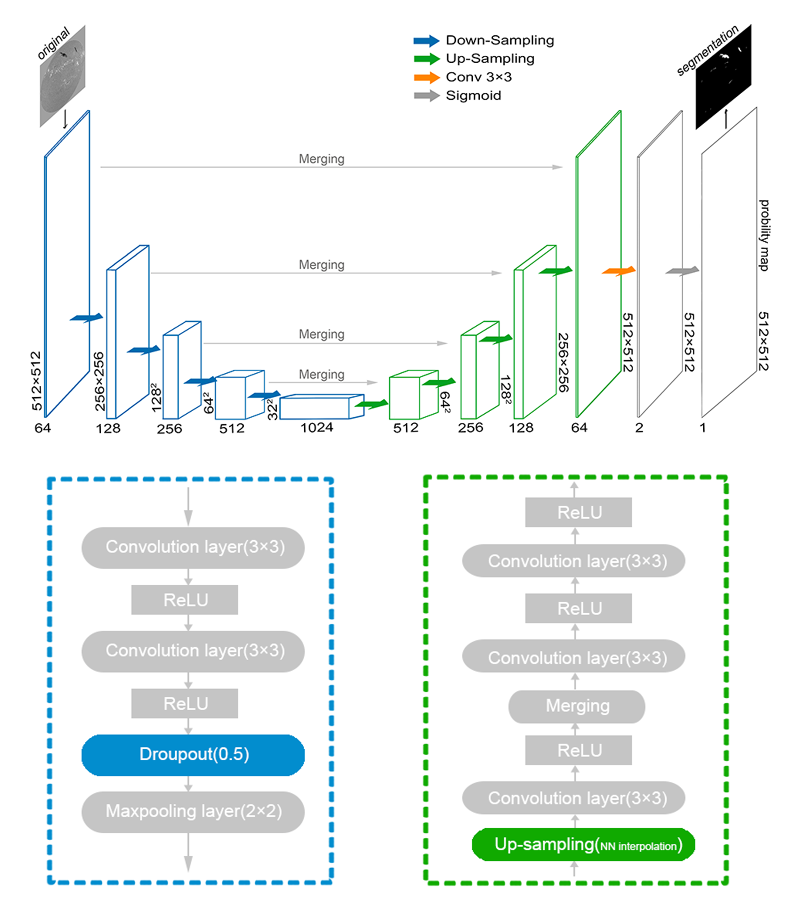

# Filament-Unet

An improved Unet network for filament recognition.

---

## Overview

### Data

The filament segmentation dataset is availble in http://sun.bao.ac.cn/hsos_data/download/filaments-unet-dataset. 

Before using it, we strongly recommend that you be able to manually correct groundtruth again.

### Model and Network

## How to use

###Run filament_predict.py

you could use trained model to predict segmentation results in data/filament/test. The result is inspiring.

###Run filament_training.py

you could train the model through running filament_training.py.

